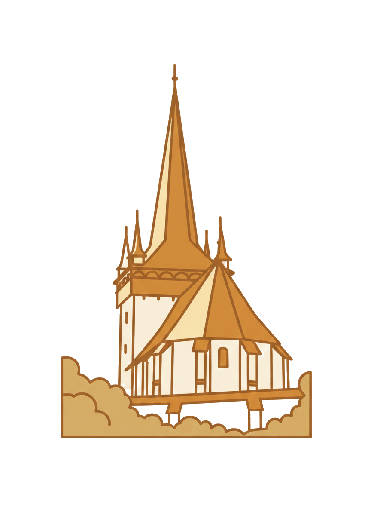
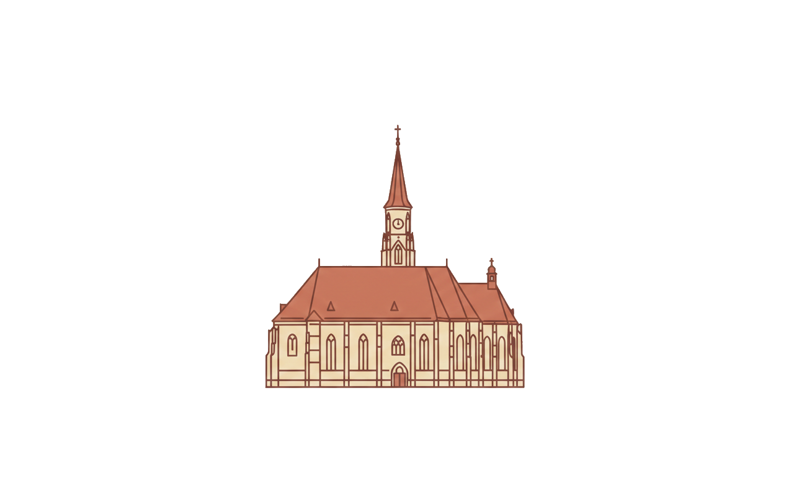
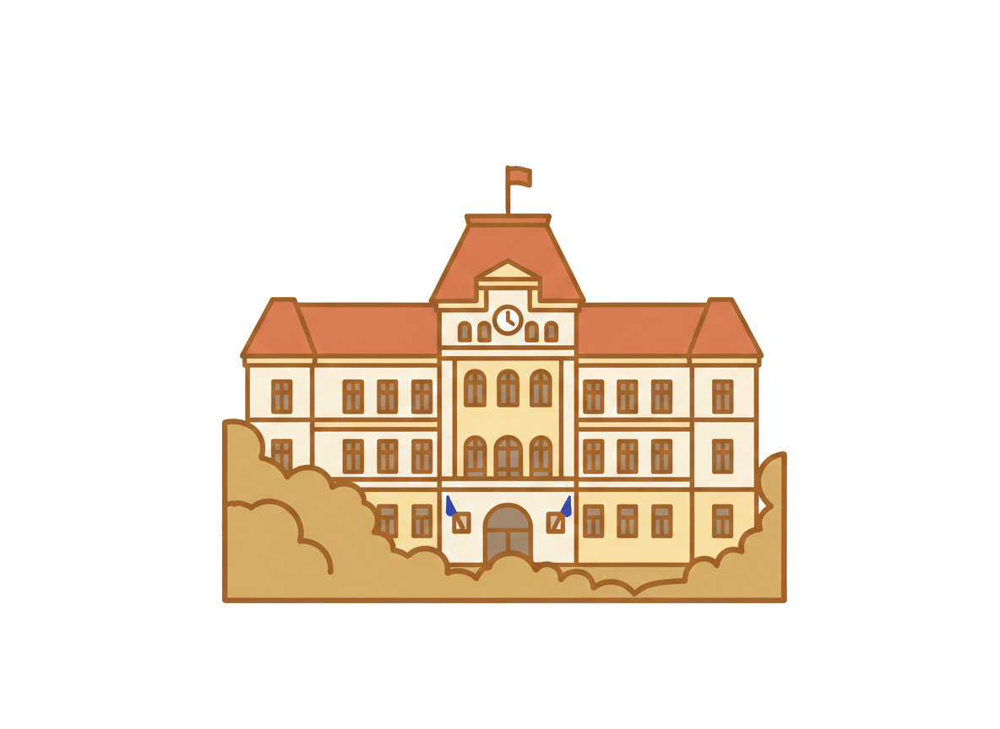
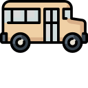

# Route Animation Documentation

## Overview

The route animation is a visual representation of the bus journey from multiple pickup locations to the wedding venue (Magic Harghita Resort). It displays four locations connected by a path, with a bus icon that animates along the route when the section comes into view.

## Current Implementation

### HTML Structure

Located in `index.html` within the Location section (`#helyszin`):

```html
<div class="route-section">
  <p class="route-section__intro" data-i18n="location.travelHelp">...</p>
  
  <div class="route-animation" id="routeAnimation" aria-label="Útvonal animáció">
    <div class="route-path">
      <!-- Location Stop 1 -->
      <div class="route-stop">
        
        <span class="route-stop__label" data-i18n="route.stop1">Magyarvalkó/Văleni (Călățele)</span>
      </div>
      <div class="route-line route-line--1"></div>
      
      <!-- Location Stop 2 (Larger) -->
      <div class="route-stop route-stop--2">
        
        <span class="route-stop__label" data-i18n="route.stop2">Kolozsvár/Cluj-Napoca</span>
      </div>
      <div class="route-line route-line--2"></div>
      
      <!-- Location Stop 3 -->
      <div class="route-stop">
        
        <span class="route-stop__label" data-i18n="route.stop3">Székelyudvarhely/Odorheiu-Secuiesc</span>
      </div>
      <div class="route-line route-line--3"></div>
      
      <!-- Location Stop 4 (End/Destination) -->
      <div class="route-stop route-stop--end">
        
        <span class="route-stop__label" data-i18n="route.stop4">Magic Harghita Resort</span>
      </div>
      
      <!-- Bus Icon (Animated) -->
      <div class="route-bus" id="routeBus">
        
      </div>
    </div>
  </div>
  
  <div class="actions actions--center">
    <a class="btn btn--primary" id="travelFormLink" href="..." data-i18n="location.travelButton">...</a>
  </div>
</div>
```

### JavaScript Animation Trigger

Located in `index.html` inline script (lines ~450-487):

```javascript
// Lazy load and animate route when Location section is visible
(function() {
  function initRouteAnimation() {
    const routeAnimation = document.getElementById('routeAnimation');
    const routeBus = document.getElementById('routeBus');
    if (!routeAnimation || !routeBus) return;
    
    let hasAnimated = false;
    
    const observer = new IntersectionObserver(function(entries) {
      entries.forEach(function(entry) {
        if (entry.isIntersecting && !hasAnimated) {
          hasAnimated = true;
          routeAnimation.classList.add('route-animation--visible');
          
          // Start bus animation after a short delay
          setTimeout(function() {
            routeBus.classList.add('route-bus--visible');
            setTimeout(function() {
              routeBus.classList.add('route-bus--moving');
            }, 200);
          }, 300);
          
          observer.unobserve(entry.target);
        }
      });
    }, { rootMargin: '100px' });
    
    observer.observe(routeAnimation);
  }
  
  if (document.readyState === 'loading') {
    document.addEventListener('DOMContentLoaded', initRouteAnimation);
  } else {
    initRouteAnimation();
  }
})();
```

**Animation Flow:**
1. Intersection Observer watches for `#routeAnimation` entering viewport (with 100px margin)
2. When visible, adds `route-animation--visible` class (fade-in effect)
3. After 300ms delay, adds `route-bus--visible` class (bus opacity becomes 1)
4. After additional 200ms delay, adds `route-bus--moving` class (starts CSS animation)

### CSS Styles - Desktop (Default)

**Container & Layout:**
- `.route-section`: Max-width 1200px, centered, padding 0 20px
- `.route-animation`: Initially `opacity: 0`, `transform: translateY(20px)`, transitions to visible
- `.route-path`: `display: flex`, horizontal layout with `justify-content: space-between`, `align-items: center`

**Route Stops:**
- `.route-stop`: `display: flex`, `flex-direction: column`, `align-items: center`
- `.route-stop__icon`: 
  - Default (stops 1, 3): 160px × 160px
  - `.route-stop--2`: 243px × 243px (larger)
  - `.route-stop--end`: 48px × 48px (smaller, final destination)
  - Positioned absolutely: `top: 90px`, `left: 50%`, `transform: translate(-50%, -50%)`
- `.route-stop__label`: Positioned absolutely: `top: 260px`, `left: 50%`, `transform: translateX(-50%)`

**Route Lines:**
- `.route-line`: `flex: 1`, `height: 2px`, horizontal gradient background
- `.route-line::after`: Animated pulse effect using `routePulse` keyframes

**Bus:**
- `.route-bus`: `position: absolute`, `left: 0`, `top: 200px`, `transform: translateX(-50%)`
- Initial state: `opacity: 0`
- `.route-bus--visible`: `opacity: 1`
- `.route-bus--moving`: Animation `routeMove` (6s ease-in-out forwards)

**Desktop Keyframes (`@keyframes routeMove`):**
```css
@keyframes routeMove {
  0% {
    left: 0;
    transform: translateX(-50%);
  }
  33.33% {
    left: calc(25% + 80px);
    transform: translateX(-50%);
  }
  66.66% {
    left: calc(50% + 160px);
    transform: translateX(-50%);
  }
  100% {
    left: calc(75% + 240px);
    transform: translateX(-50%);
  }
}
```

The bus moves horizontally from left to right, stopping at calculated positions (25%, 50%, 75% + offsets) to align with each stop icon.

### CSS Styles - Mobile (Max-width: 720px)

**Layout Transformation:**
- `.route-path`: Changes from `display: flex` to `display: grid`
- Grid: `grid-template-columns: auto 1fr auto`
  - Column 1: Icons (left side)
  - Column 2: Labels (middle, flexible width)
  - Column 3: Bus (right side)

**Route Stops:**
- `.route-stop`: `display: contents` (disables flex, children become grid items)
- `.route-stop__icon`: 
  - `grid-column: 1`
  - `position: static !important`
  - `transform: none !important`
  - Default: 80px × 80px
  - `.route-stop--2`: 110px × 110px (25% larger than base, 38% larger than stop 1)
  - `.route-stop--end`: 36px × 36px (25% smaller)
- `.route-stop__label`: 
  - `grid-column: 2`
  - `position: static !important`
  - `text-align: left`
  - `max-width: 180px`

**Route Lines:**
- `.route-line`: `grid-column: 1`, `width: 2px`, `height: 40px` (vertical)
- `.route-line::after`: Uses `routePulseVertical` animation (moves top to bottom)

**Bus (Mobile):**
- `.route-bus`: 
  - `grid-column: 3`
  - `position: absolute !important`
  - `left: auto !important`
  - `right: 5px !important`
  - `top: 40px !important`
  - `transform: none !important`
  - `animation: none !important` (resets base animation)
  - Size: 36px × 36px
- `.route-bus--moving`: Animation `routeMoveVerticalMobile !important` (6s ease-in-out forwards)

**Mobile Keyframes (`@keyframes routeMoveVerticalMobile`):**
```css
@keyframes routeMoveVerticalMobile {
  0% {
    top: 40px !important;
    right: 5px !important;
    left: auto !important;
    bottom: auto !important;
    transform: none !important;
  }
  33.33% {
    top: 190px !important;
    right: 5px !important;
    left: auto !important;
    bottom: auto !important;
    transform: none !important;
  }
  66.66% {
    top: 340px !important;
    right: 5px !important;
    left: auto !important;
    bottom: auto !important;
    transform: none !important;
  }
  100% {
    top: 490px !important;
    right: 5px !important;
    left: auto !important;
    bottom: auto !important;
    transform: none !important;
  }
}
```

The bus should move vertically downward along the right side, stopping at `top: 40px`, `190px`, `340px`, and `490px` to align with each stop's vertical position.

## Known Issues

### Issue #1: Bus Animation Not Working on Mobile

**Problem:** On mobile devices (max-width: 720px), the bus icon appears in the upper right corner of the section but does not animate/move downward.

**Current Status:** 
- Bus is positioned correctly at initial state (`top: 40px`, `right: 5px`)
- The `route-bus--moving` class is being added (verified in JavaScript)
- CSS keyframes `routeMoveVerticalMobile` are defined
- Animation property is set with `!important` flags

**Possible Causes:**
1. **CSS Specificity Conflict:** The base `.route-bus` styles or desktop animation may be overriding mobile animation despite `!important` flags
2. **Position Context:** The bus's `position: absolute` may need a positioned parent (`.route-path` needs `position: relative` on mobile)
3. **Animation Override:** The `animation: none !important` on base `.route-bus` on mobile might be preventing the `route-bus--moving` animation from applying
4. **Grid vs Absolute Positioning:** Using `grid-column: 3` combined with `position: absolute` might create conflicting positioning contexts

**Debugging Steps Needed:**
1. Verify `.route-path` has `position: relative` on mobile viewport
2. Check if `route-bus--moving` class is actually applied in browser DevTools
3. Verify computed styles for `.route-bus--moving` show the animation property
4. Test if removing `animation: none !important` from base `.route-bus` helps
5. Check if the keyframes `routeMoveVerticalMobile` are being recognized

**Current CSS for Bus on Mobile:**
```css
@media (max-width: 720px) {
  .route-bus {
    grid-column: 3;
    position: absolute !important;
    left: auto !important;
    right: 5px !important;
    top: 40px !important;
    bottom: auto !important;
    transform: none !important;
    z-index: 10;
    width: 36px;
    height: 36px;
    animation: none !important; /* This might be preventing .route-bus--moving */
  }
  
  .route-bus--moving {
    animation: routeMoveVerticalMobile 6s ease-in-out forwards !important;
  }
}
```

**Hypothesis:** The `animation: none !important` on `.route-bus` base class may be preventing `.route-bus--moving` from working, even though `.route-bus--moving` also has `!important`. CSS specificity rules might be evaluating both as equal specificity, causing conflicts.

**Proposed Fix:**
1. Remove `animation: none !important` from base `.route-bus` on mobile
2. Ensure `.route-path` has `position: relative` on mobile
3. Verify the `routeMoveVerticalMobile` keyframes use `top` and `right` properties correctly (currently implemented)
4. Consider using CSS custom properties or a more specific selector for the moving state

## Requirements

### Functional Requirements

1. **Desktop (width > 720px):**
   - Bus should animate horizontally from left to right
   - Bus should stop at each of the 4 locations (25%, 50%, 75%, 100% positions)
   - Animation should be smooth (ease-in-out), duration 6 seconds
   - Animation should only trigger once when section enters viewport

2. **Mobile (width ≤ 720px):**
   - Layout should switch to vertical (3-column grid: icons | labels | bus)
   - Bus should be positioned on the right side (`right: 5px`)
   - Bus should animate vertically from top to bottom
   - Bus should stop at each of the 4 locations' vertical positions
   - Animation should be smooth (ease-in-out), duration 6 seconds
   - Animation should only trigger once when section enters viewport

3. **Performance:**
   - Animation should not start until section is visible (lazy loading)
   - Should use CSS transforms/position for performance (avoid layout thrashing)
   - Animation should only play once per page load

4. **Accessibility:**
   - Animation should respect `prefers-reduced-motion` (currently not implemented)
   - Should have `aria-label` on animation container

### Visual Requirements

1. **Desktop:**
   - Horizontal path with 4 stops
   - Bus size: 65px × 65px
   - Location icons: 160px (stops 1,3), 243px (stop 2), 48px (stop 4)
   - Bus positioned at `top: 200px` relative to route path

2. **Mobile:**
   - Vertical layout with 3 columns
   - Bus size: 36px × 36px
   - Location icons: 80px (stop 1), 110px (stop 2), 80px (stop 3), 36px (stop 4)
   - Bus positioned at `right: 5px`, moving vertically
   - Icons aligned to left column, labels in middle column, bus in right column

### Animation Timing

- **Delay Before Animation:** 500ms total (300ms for route container fade-in, 200ms before bus visibility, 200ms before movement)
- **Animation Duration:** 6 seconds
- **Easing:** `ease-in-out`
- **Stops:** 
  - 33.33% of duration (~2s) at first intermediate stop
  - 66.66% of duration (~4s) at second intermediate stop
  - 100% of duration (~6s) at final destination

## File Locations

- **HTML:** `index.html` (lines ~242-286, JavaScript lines ~450-487)
- **CSS:** `styles.css` (lines ~551-901)
- **Images:** 
  - `./route-stop-1.png` (160×160px, Location 1)
  - `./route-stop-2.png` (243×243px, Location 2, largest)
  - `./route-stop-3.png` (160×160px, Location 3)
  - `./route-stop-4.png` (48×48px, Final destination)
  - `./route-bus.png` (65×65px, Bus icon)

## CSS Class Reference

### State Classes
- `.route-animation--visible`: Container fade-in (opacity: 1, transform: translateY(0))
- `.route-bus--visible`: Bus fade-in (opacity: 1)
- `.route-bus--moving`: Bus animation start (applies CSS animation)

### Layout Classes
- `.route-section`: Outer container
- `.route-animation`: Animation container with fade-in
- `.route-path`: Flex container (desktop) / Grid container (mobile)
- `.route-stop`: Individual location container
- `.route-stop--2`: Second location (larger icon)
- `.route-stop--end`: Final destination (smaller icon)
- `.route-line`: Path segment between stops
- `.route-bus`: Bus icon container

### Element Classes
- `.route-stop__icon`: Location icon image
- `.route-stop__label`: Location name label
- `.route-section__intro`: Introduction text above animation

## Next Steps for Fixing Mobile Animation

1. **Verify Parent Positioning:**
   ```css
   @media (max-width: 720px) {
     .route-path {
       position: relative; /* Ensure this is present */
     }
   }
   ```

2. **Adjust Animation Reset:**
   ```css
   @media (max-width: 720px) {
     .route-bus {
       /* Remove animation: none, let moving state handle it */
       animation: none; /* Remove !important, or remove entirely */
     }
   }
   ```

3. **Increase Specificity of Moving State:**
   ```css
   @media (max-width: 720px) {
     .route-path .route-bus.route-bus--moving {
       animation: routeMoveVerticalMobile 6s ease-in-out forwards !important;
     }
   }
   ```

4. **Debug in Browser DevTools:**
   - Check computed styles for `.route-bus--moving`
   - Verify animation property is applied
   - Check if keyframes are registered
   - Test animation manually by toggling classes

5. **Alternative Approach:**
   - Consider using CSS custom properties for animation values
   - Use `will-change: top` on mobile for performance hint
   - Ensure no conflicting transforms or transitions interfere

## Developer Analysis & Solutions

### Developer 1: Separated Track Layer Approach (Phase 1 - Quick Fix)

**Core Problem Identified:**
- Hardcoded pixel values (`top: 190px`, `top: 340px`, `top: 490px`) break when layout changes
- Animating `top`/`left` causes layout thrashing (CPU-intensive)
- Excessive `!important` flags indicate architectural problems
- Mixing Grid, Flex, and absolute positioning creates conflicts

**Solution: "The Separated Track Layer"**
- **Track Layer (Behind):** Absolutely positioned layer containing only the route line and bus
- **Content Layer (Front):** Standard Flex/Grid layout for icons and text labels
- Use `transform: translateY()` instead of `top` for mobile animation (GPU-accelerated)
- Remove all `!important` flags by proper CSS structure

**Architecture:**
```
.route-path (position: relative)
  ├── .route-track (position: absolute, z-index: 0)
  │   ├── .route-line (unified line)
  │   └── .route-bus (animated element)
  └── .route-content (position: relative, z-index: 1)
      └── .route-stop elements (icons + labels)
```

**Benefits:**
- Zero `!important` flags needed
- GPU-accelerated animations (uses `transform`)
- Responsive by default (percentage-based positioning)
- Easy to maintain (clear separation of concerns)

**Complexity:** Low | **Performance:** Good | **Maintainability:** Medium

### Developer 2: SVG Path + offset-path Approach (Phase 2 - Long-term Solution)

**Core Problem Identified:**
- Manual calculation of stop positions is fragile
- Pixel-perfect positioning breaks on responsive changes
- No single source of truth for route geometry

**Solution: "SVG Path as Single Source of Truth"**
- **SVG Path:** Define route geometry once in SVG (invisible path element)
- **CSS offset-path:** Use modern CSS `offset-path` to animate along SVG path
- **JS Fallback:** Use `SVGPathElement.getPointAtLength()` for older browsers
- Feature detection determines which method to use

**Architecture:**
```html
<svg class="route-svg" aria-hidden="true">
  <path id="routePath" d="M60 200 L360 160 L760 160 L1140 200" />
</svg>
<div class="route-bus" id="routeBus">
  <!-- Bus animated along SVG path -->
</div>
```

**CSS (Modern Browsers):**
```css
.route-bus--moving {
  offset-path: path("M60 200 L360 160 L760 160 L1140 200");
  animation: busMovePath 6s ease-in-out forwards;
}

@keyframes busMovePath {
  0% { offset-distance: 0%; }
  33.33% { offset-distance: 33.33%; }
  66.66% { offset-distance: 66.66%; }
  100% { offset-distance: 100%; }
}
```

**JavaScript Fallback:**
```javascript
const pathLength = svgPath.getTotalLength();
const point = svgPath.getPointAtLength(pathLength * progress);
routeBus.style.transform = `translate3d(${point.x}px, ${point.y}px, 0)`;
```

**Benefits:**
- Single source of truth (SVG path defines geometry)
- Perfect alignment (bus follows exact path)
- GPU-accelerated (CSS offset-path uses transforms)
- Graceful degradation (JS fallback for older browsers)
- Accessibility-ready (easy to respect `prefers-reduced-motion`)

**Complexity:** Medium | **Performance:** Excellent | **Maintainability:** High

### Comparison Table

| Approach | Complexity | Performance | Cross-device Reliability | Maintainability | Browser Support |
|----------|-----------|-------------|-------------------------|-----------------|-----------------|
| **Current (top/left keyframes)** | Low | Poor | Unreliable | Low | All |
| **Phase 1: Separated Track Layer** | Low-Medium | Good | Good | Medium | All |
| **Phase 2: SVG + offset-path** | Medium | Excellent | Very Good | High | Modern + JS fallback |

### Migration Path Recommendations

1. **Immediate Fix (Phase 1):**
   - Implement Developer 1's separated track layer approach
   - Fixes mobile animation immediately (unblocks users)
   - Removes `!important` hacks
   - Uses GPU-accelerated transforms
   - **Estimated Time:** 2-3 hours

2. **Long-term Solution (Phase 2):**
   - Implement Developer 2's SVG path approach when time permits
   - Better maintainability and accuracy
   - Single source of truth for route geometry
   - Graceful fallback ensures all browsers work
   - **Estimated Time:** 4-6 hours

3. **Implementation Order:**
   - Phase 1 first (immediate fix)
   - Test and document results
   - Phase 2 later (refactor for better architecture)

### Key Learnings

1. **Avoid Hardcoded Pixels:** Use percentages, CSS variables, or SVG paths for responsive positioning
2. **Prefer Transforms:** Always use `transform` instead of `top`/`left` for animations (GPU-accelerated)
3. **Separate Concerns:** Keep visual track (line + bus) separate from content (icons + labels)
4. **Single Source of Truth:** Use SVG for geometry definition, not scattered CSS calculations
5. **Feature Detection:** Always provide fallbacks for modern CSS features like `offset-path`
